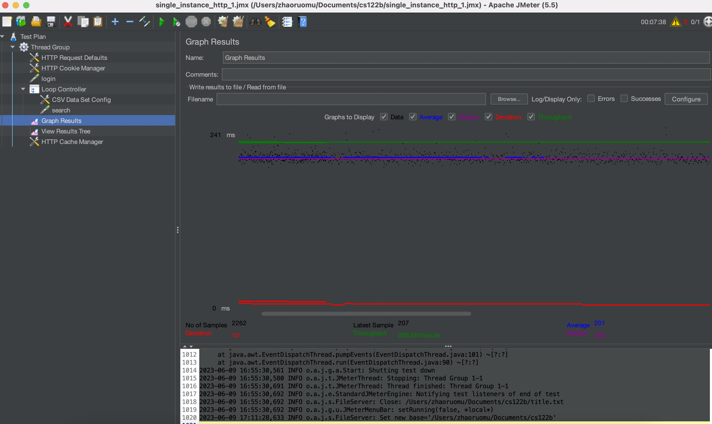
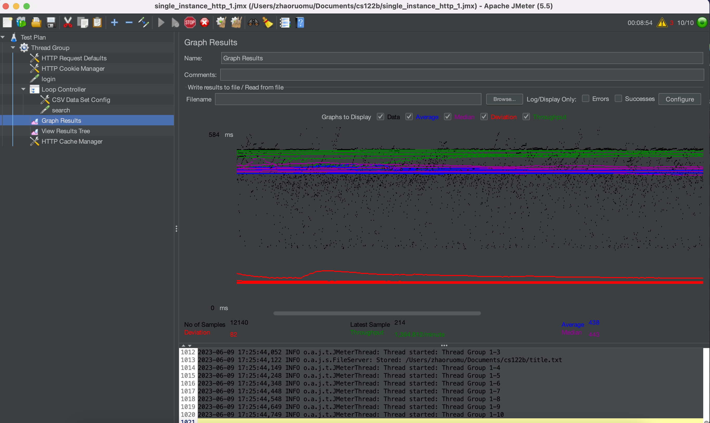
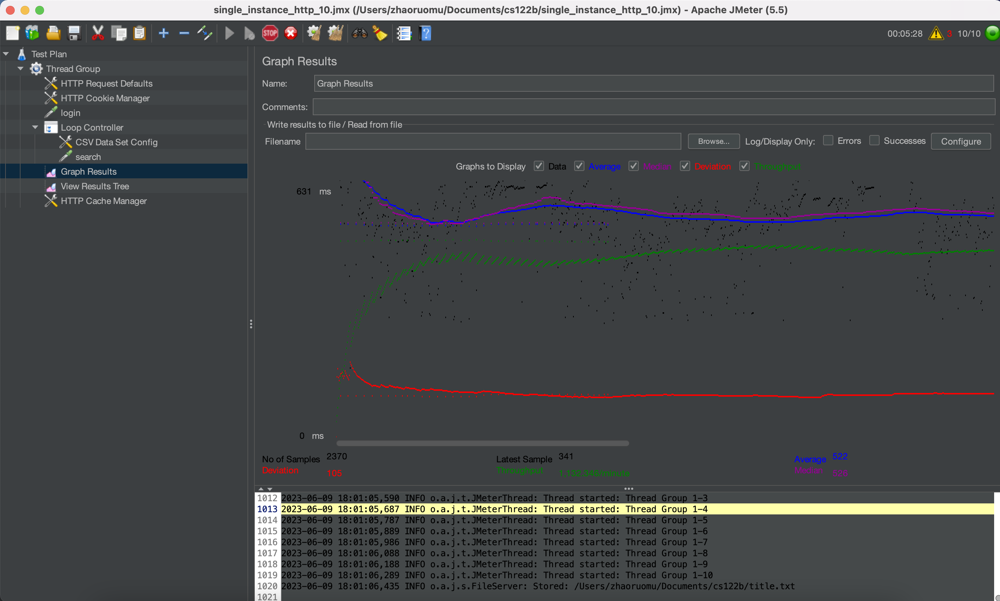
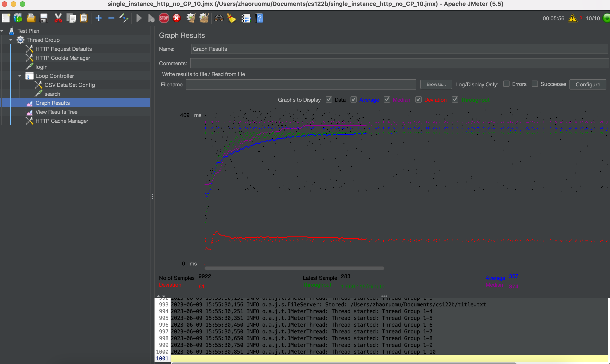
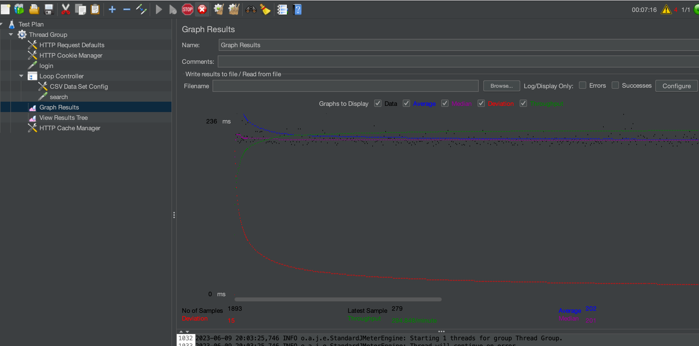
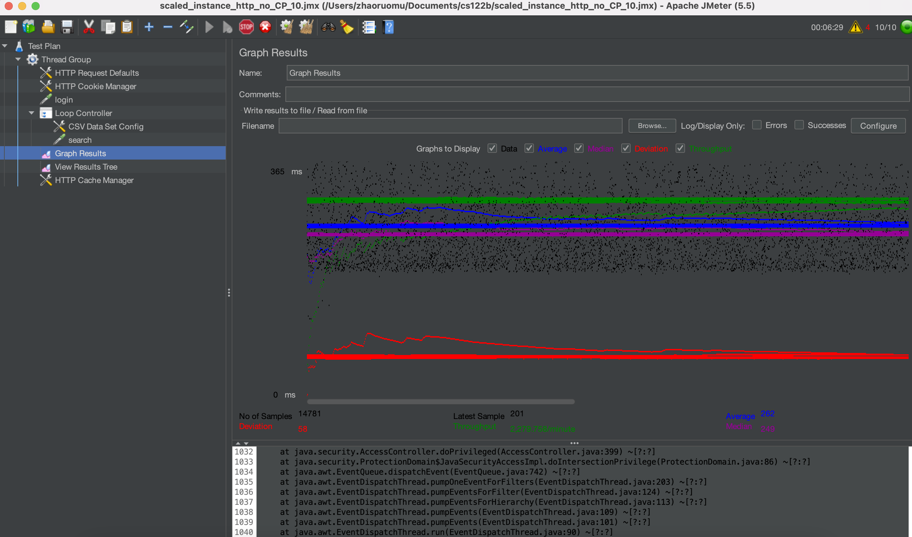
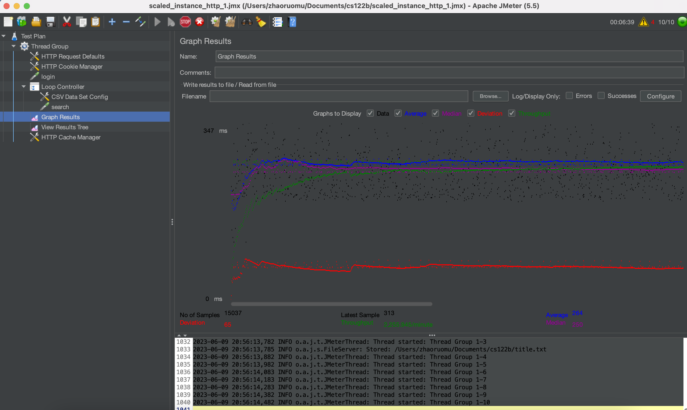

- # General
    - #### Team#:fish
    
    - #### Names:Ruomu Zhao
    
    - #### Project 5 Video Demo Link:

    - #### Instruction of deployment:  If it is for single_instance, the port in the url of the WebContent/META_INF/context.xml should be 3306. Else, if it is for scaled_instance, change the port number to 6033 for the proxySQL routers. Also, delete the security constrain part in the WebContent/WEB_INF/web.xml to disallow https redirecting for scaled-version. In server instance 2, instance 3, git clone the repo and change the port. Call mvn clean package to get the war file to deploy. For the 122b-ruomuz-project server, leave the port number to 3306. Call mvn clean package to deploy.

    - #### Collaborations and Work Distribution: Me

- # Connection Pooling
    - #### Include the filename/path of all code/configuration files in GitHub of using JDBC Connection Pooling.
    WebContent/META_INF/context.xml
    - #### Explain how Connection Pooling is utilized in the Fabflix code.
    In my servlet, I first get the data source that is defined in my context.xml. Then I get a connection from the pool of connections in the datasource. I do not need to close the connection in my code. Also, I set the cachePrepStmts to be true.
    - #### Explain how Connection Pooling works with two backend SQL.
    I use a router to route the queries. So the connection pool is a pool of connections to my router. The router does the read/write splitting and load balancing job.

- # Master/Slave
    - #### Include the filename/path of all code/configuration files in GitHub of routing queries to Master/Slave SQL.
proxySQLConfigCommand.txt under the root directory. This file include all the commands I need to install and configure the proxySQL as a query router and a load balancer.
    - #### How read/write requests were routed to Master/Slave SQL?
    I configured proxySQL as a query router for both of my master and slave server. The proxySQL check the read_only variable regularly to see if a server is writable or not. The proxySQL will based on several regular expression query rules that I defined. For example, if a query is like "^insert.*", it will be redirect to only master server. I only need to modified the port of the url in the context.xml file from 3306 to 6033. Also, the proxySQL does the load balancer job as well.

- # JMeter TS/TJ Time Logs
    - #### Instructions of how to use the `log_processing.*` script to process the JMeter logs.
 - Putting the log_processing.py and the logs in the same folder. Call ./log_processing.py <filename>.log

- # JMeter TS/TJ Time Measurement Report

| **Single-instance Version Test Plan**          | **Graph Results Screenshot** | **Average Query Time(ms)** | **Average Search Servlet Time(ms)** | **Average JDBC Time(ms)** | **Analysis** |
|------------------------------------------------|------------------------------|----------------------------|-------------------------------------|---------------------------|--------------|
| Case 1: HTTP/1 thread                          |    | 204                         | 189.5                                  | 189.1                        | It takes 189.1ms to run the jdbc part. It takes 204 ms in total to finish the query.           |
| Case 2: HTTP/10 threads                        |    | 435                         | 215.7                                  | 215.4                        | The average servlet time and jdbc time are higher than 1 thread.             |
| Case 3: HTTPS/10 threads                       |    | 509                         | 245.4                                  | 244.3                        | The average query time is much higher than the http version. The encription process may be the cause.           |
| Case 4: HTTP/10 threads/No connection pooling  |    | 360                         | 191                                  | 177                        | The difference between TS and TJ is larger because of lack of connection pooling.           |

| **Scaled Version Test Plan**                   | **Graph Results Screenshot** | **Average Query Time(ms)** | **Average Search Servlet Time(ms)** | **Average JDBC Time(ms)** | **Analysis** |
|------------------------------------------------|------------------------------|----------------------------|-------------------------------------|---------------------------|--------------|
| Case 1: HTTP/1 thread                          |    | 206                         | 32                                  | 31                        | In query is completed a lot more faster than unscaled version, because there are two mysql database that can handle the readings           |
| Case 2: HTTP/10 threads                        |    | 259                         | 90.9                                  | 90.4                        |     Compared to 1 thread is slower. But still, the scaled version is faster than the single version.       |
| Case 3: HTTP/10 threads/No connection pooling  |    | 253                         | 95                                 | 87                        |    The difference between TS and TJ is larger because of lack of connection pooling.        |
